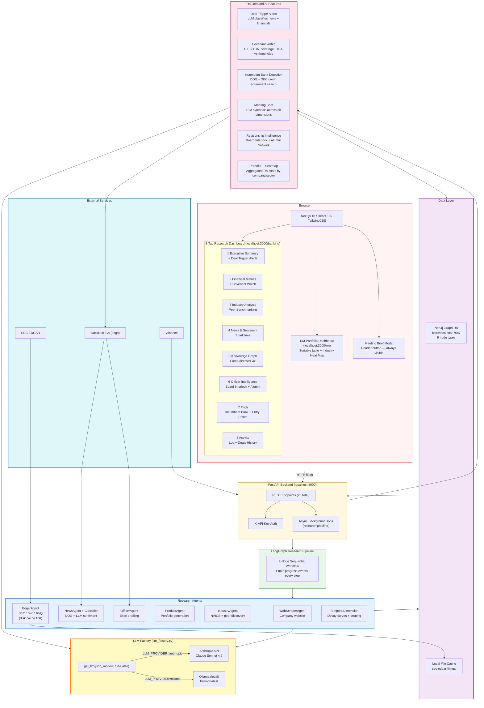
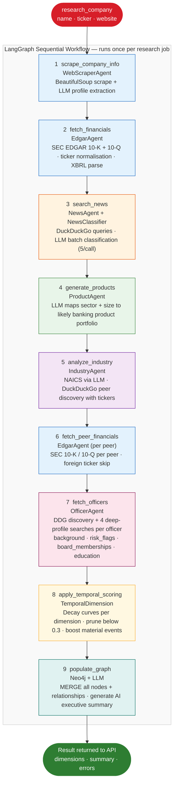
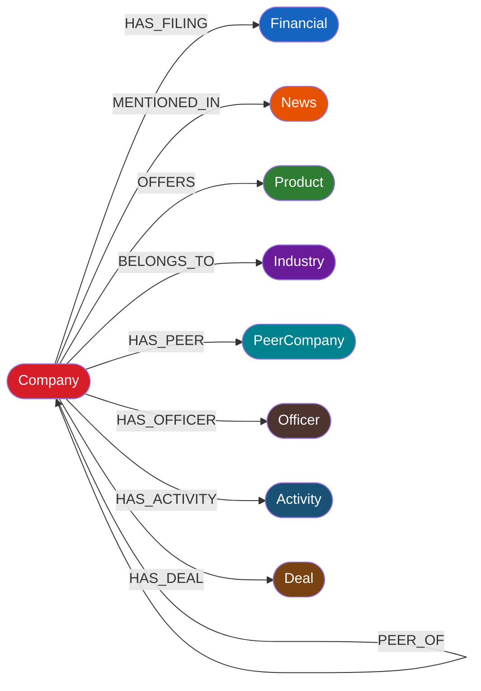

# Context Fabric

> AI-Powered Commercial Banking Knowledge Graph for Pre-Meeting Intelligence

Context Fabric is a production-grade research platform that helps commercial relationship managers prepare for client meetings in under 2 minutes. It automatically researches companies across **7 intelligence dimensions**, stores the results in a Neo4j knowledge graph, and presents them through an interactive dashboard with a one-click **PDF export**.

---

## Architecture

See [docs/architecture.md](docs/architecture.md) for the full system architecture diagram (Mermaid).  
See [docs/agent_flow.md](docs/agent_flow.md) for the LangGraph agent workflow diagram (Mermaid).

---

## Quick Start

### Prerequisites

- **Python 3.10+** with virtual environment
- **Node.js 18+** and npm
- **Docker** — for Neo4j graph database
- **Anthropic API key** OR **Ollama** (local) — see LLM Configuration below

### 1. Clone & configure

```bash
cd /Users/aaronotto/Desktop/Claude
cp .env.example .env   # then edit .env
```

**.env** minimum required:
```env
ANTHROPIC_API_KEY=your_key_here   # required for Anthropic mode
NEO4J_URI=bolt://localhost:7687
NEO4J_USER=neo4j
NEO4J_PASSWORD=password
USER_EMAIL=your_email@example.com

# LLM Provider — choose one:
LLM_PROVIDER=anthropic             # default — uses Claude Sonnet 4.6
# LLM_PROVIDER=ollama              # local — uses Ollama (no API key needed)
# OLLAMA_MODEL=llama3:latest       # default Ollama model

# Optional — service API auth
# BANKING_API_KEY=your-secret-key

# Optional — CORS for deployed frontend
# BANKING_CORS_ORIGINS=https://yourapp.com
```

> **LLM Configuration**: Set `LLM_PROVIDER=anthropic` (default) to use Claude Sonnet 4.6 via Anthropic API. Set `LLM_PROVIDER=ollama` to use a local Ollama model — useful when Anthropic credits are unavailable. Quality is higher with Claude.

### 2. Python dependencies

```bash
source /Users/aaronotto/.local/share/virtualenvs/ice_breaker-tUk_0iHV/bin/activate
pip install -r requirements.txt
```

### 3. Frontend dependencies

```bash
cd src/kg_frontend && npm install && cd ../..
```

---

## Running the App

You need **3 terminals** from the project root.

### Terminal 1 — Neo4j Database

```bash
# First run
docker run --name banking-neo4j -d \
  -p 7474:7474 -p 7687:7687 \
  -e NEO4J_AUTH=neo4j/password \
  neo4j:latest

# Subsequent runs
docker start banking-neo4j
```

Neo4j browser: http://localhost:7474 (login: `neo4j` / `password`)

### Terminal 2 — FastAPI Backend

```bash
source /Users/aaronotto/.local/share/virtualenvs/ice_breaker-tUk_0iHV/bin/activate
python -m uvicorn src.banking_kg.api:app --reload --port 8000
```

- API base: http://localhost:8000
- Interactive docs: http://localhost:8000/docs

### Terminal 3 — Next.js Frontend

```bash
cd src/kg_frontend
npm run dev
```

Dashboard: **http://localhost:3000/banking**

---

## Using the Dashboard

### 1. Enter company details
- **Company Name** (required) — e.g. `Tesla`
- **Ticker** (optional) — e.g. `TSLA` — enables SEC financial data and peer comparison
- **Website** (optional) — e.g. `https://tesla.com` — improves company profile accuracy

### 2. Start AI Research
Click **Start AI Research**. The progress bar tracks 9 LangGraph nodes:

| Step | Agent | What it does |
|------|-------|-------------|
| Company Info | WebScraperAgent | Scrapes website, extracts structured profile |
| Financials | EdgarAgent | Downloads 10-K / 10-Q from SEC EDGAR |
| News | NewsAgent + NewsClassifier | DuckDuckGo search + Claude sentiment/severity |
| Products | ProductAgent | Generates product portfolio via Claude |
| Industry | IndustryAgent | NAICS classification + peer discovery |
| Peer Financials | EdgarAgent | EDGAR filings for each peer company |
| Officer Intelligence | OfficerAgent | Web search + deep profiles on key executives |
| Temporal Weighting | TemporalDimension | Freshness decay scoring + stale data pruning |
| Knowledge Graph | Neo4j | Stores all dimensions, generates summary |

Research completes in **60–120 seconds** depending on company and network.

### 3. Explore the 7 tabs

| Tab | Content |
|-----|---------|
| **Executive Summary** | Company snapshot, WF affinity signals, deal trigger alerts, news sentiment |
| **Financial Metrics** | Income statement, balance sheet, cash flow — period over period |
| **Industry Analysis** | NAICS sector, peer benchmarking, industry trends, SVG bar charts |
| **News & Sentiment** | Classified news with severity, sentiment, stock price impact sparklines |
| **Knowledge Graph** | Force-directed graph — click any node for detail panel |
| **Officer Intelligence** | Executive profiles, risk flags, Board Interlock Map (WF officer overlap), Alumni Network |
| **Pitch** | Incumbent Bank detection, product recommendations, warm entry points, relationship-based approach |
| **Activity** | RM activity log (calls/emails/meetings) + prior WF deals history |

### 4. Export PDF
Click **⬇ Export PDF** in the header. A formatted A4 intelligence brief downloads immediately — includes cover page, financials, peer comparison, industry, news, officer profiles, and products.

---

## Service API

The backend can be called as a standalone service from any system.

### Authentication

Set `BANKING_API_KEY=your-secret` in `.env`. Then pass the header:
```
X-API-Key: your-secret
```
If `BANKING_API_KEY` is not set, all endpoints are open (dev mode).

### Key service endpoints

```bash
# Research a company (async — poll status until complete)
curl -X POST http://localhost:8000/research/start \
  -H "Content-Type: application/json" \
  -d '{"company_name": "Tesla", "ticker": "TSLA"}'

# Poll until status == "completed"
curl http://localhost:8000/research/status/{job_id}

# Get structured JSON intelligence report
curl -H "X-API-Key: your-secret" \
  http://localhost:8000/company/Tesla/report

# Download PDF intelligence brief
curl -H "X-API-Key: your-secret" \
  -o tesla_brief.pdf \
  http://localhost:8000/company/Tesla/report/pdf

# Research a specific person manually
curl -X POST http://localhost:8000/officer/search \
  -H "Content-Type: application/json" \
  -d '{"name": "Jane Smith", "company": "Tesla", "role": "CFO"}'
```

Full API reference: http://localhost:8000/docs

---

## Project Structure

```
Claude/
├── README.md                         # This file
├── PRD.md                            # Product requirements document
├── requirements.txt                  # Python dependencies
├── .env                              # Secrets — gitignored
├── docs/
│   ├── architecture.md               # System architecture Mermaid diagram
│   └── agent_flow.md                 # LangGraph agent flow Mermaid diagram
├── src/
│   ├── banking_kg/                   # Backend
│   │   ├── api.py                    # FastAPI endpoints + API key auth
│   │   ├── research_orchestrator.py  # LangGraph 9-node workflow
│   │   ├── neo4j_db.py               # Neo4j CRUD + graph queries
│   │   ├── llm_factory.py            # get_llm() — Anthropic or Ollama
│   │   ├── report_generator.py       # reportlab PDF intelligence brief
│   │   ├── temporal.py               # Data freshness scoring + decay curves
│   │   ├── bank_officers.py          # WF officer registry + relationship matching
│   │   └── agents/
│   │       ├── web_scraper_agent.py  # Company website scraper
│   │       ├── edgar_agent.py        # SEC EDGAR 10-K/10-Q + disk cache
│   │       ├── news_agent.py         # DuckDuckGo news search
│   │       ├── news_classifier.py    # Batch LLM sentiment classification
│   │       ├── product_agent.py      # Product portfolio generation
│   │       ├── industry_agent.py     # NAICS + peer discovery (ReAct + DDG)
│   │       └── officer_agent.py      # Executive profiling + risk flags
│   └── kg_frontend/                  # Next.js 16 frontend
│       ├── app/banking/page.tsx      # Main dashboard (8 tabs + PDF button)
│       ├── app/rm/page.tsx           # RM Portfolio dashboard
│       ├── lib/api.ts                # API client
│       └── components/
│           ├── InsightsOverview.tsx  # Company snapshot
│           ├── FinancialMetrics.tsx  # Self-fetching financial data
│           ├── IndustryComparison.tsx
│           ├── PeerComparison.tsx    # SVG bar charts — 6 metrics
│           ├── CovenantWatch.tsx     # Financial ratio monitoring
│           ├── TriggerAlerts.tsx     # Deal trigger alerts
│           ├── OfficerResearch.tsx   # Officer cards + Board Interlock Map
│           ├── WFCommonality.tsx     # WF affinity signals
│           ├── ScoreTooltip.tsx      # Shared tooltip system
│           ├── Recommendations.tsx   # Pitch + products
│           ├── IncumbentBank.tsx     # Incumbent bank detection
│           ├── MeetingBrief.tsx      # Pre-meeting modal
│           ├── NewsAnalysis.tsx
│           ├── GraphVisualization.tsx
│           └── ResearchProgress.tsx
├── sec-edgar-filings/                # Cached SEC filing downloads (55+ tickers)
└── tests/
    └── test_knowledge_graph.py
```

---

## Example Companies

| Company | Ticker | Notes |
|---------|--------|-------|
| Tesla | TSLA | Full data — EDGAR + peers + officers |
| JPMorgan Chase | JPM | Full banking context |
| Goldman Sachs | GS | Full data |
| Apple Inc. | AAPL | Full data |
| Microsoft | MSFT | Full data |
| Stripe | — | Private — web + news only |

---

## Stopping

```bash
# Frontend — Ctrl+C in Terminal 3
# Backend  — Ctrl+C in Terminal 2
docker stop banking-neo4j
```

---

## Troubleshooting

**Neo4j won't connect**
```bash
docker ps | grep neo4j
docker logs banking-neo4j
docker start banking-neo4j
```

**Backend import errors**
```bash
source /Users/aaronotto/.local/share/virtualenvs/ice_breaker-tUk_0iHV/bin/activate
pip install -r requirements.txt
```

**PDF endpoint returns 500**
```bash
pip install reportlab
tail -50 backend.log
```

**LLM returns empty results / no triggers**
- If using Anthropic: check API credits at console.anthropic.com
- Switch to Ollama: set `LLM_PROVIDER=ollama` in `.env`, restart backend
- Ensure Ollama is running: `ollama serve` and model pulled: `ollama pull llama3`

**Research slow / stuck**
- First-time EDGAR downloads: 30–60 s (then cached)
- Officer research: +20–60 s (4 web searches per officer)
- Check `backend.log` for per-node progress

---

## Tech Stack

| Component | Technology |
|-----------|-----------|
| Frontend | Next.js 16, React 19, TypeScript, TailwindCSS |
| Backend | FastAPI, Python 3.10+, uvicorn |
| AI Orchestration | LangGraph + LangChain |
| LLM | Claude Sonnet 4.6 (Anthropic) or Ollama (local) |
| Graph DB | Neo4j 4.x (Docker) |
| PDF Generation | reportlab 4.x |
| Web Search | ddgs (DuckDuckGo) |
| SEC Data | sec-edgar-downloader (disk-cached 55+ tickers) |
| Stock Data | yfinance |
| Graph Viz | react-force-graph-2d |

---

## System Architecture



---

## LangGraph Research Pipeline



---

## Neo4j Graph Schema



---

## TTL Cache Policy

All cached data in Neo4j expires after a dimension-specific TTL. The research pipeline skips re-fetching when the cached node is still fresh.

| Dimension | TTL | Notes |
|-----------|-----|-------|
| Financial data | **30 days** | Re-fetch if filing node is older than this |
| NAICS classification | **180 days** | Industry code changes rarely |
| Peer company list | **180 days** | Peer list (not their financials) |
| Company info | **7 days** | Website-scraped overview |
| News | **7 days** | Refreshed frequently |
| Officer profiles | **120 days** | Executive roles are volatile |
| Board interlocks | **180 days** | Board seats change every ~6 months |
| Incumbent bank | **365 days** | Credit agreements are annual |

**EDGAR disk cache (separate from Neo4j TTL):** If the raw SEC filing already exists on disk under `sec-edgar-filings/{TICKER}/{TYPE}/`, the download is skipped entirely — regardless of Neo4j TTL. This covers 55+ pre-cached tickers.

---

## Relevance Scoring

Every item in the graph carries a `relevance_score` (0.0 – 1.0) computed by `TemporalDimension`.

### Score Formula

$$\text{total\_score} = (\text{recency\_score} \times 0.6) + (\text{content\_score} \times 0.4)$$

**Recency score** — linear decay within the relevance window, exponential beyond it:

| Range | Formula |
|-------|---------|
| Within window | $1.0 - \frac{\text{days\_old}}{\text{window}} \times 0.7$ (decays to 0.3 at edge) |
| Beyond window | $0.3 \times (1 - \text{decay\_rate})^{\text{extra\_days}}$, floored at 0.0 |

**Relevance windows and decay rates by data type:**

| Data type | Window (days) | Decay rate |
|-----------|:---:|:---:|
| News | 90 | 0.05 |
| Financial (annual) | 365 | 0.01 |
| Financial (quarterly) | 120 | — |
| Products | 730 | 0.02 |
| Industry trends | 180 | 0.03 |
| Company info | 365 | — |
| Officer profiles | 120 | 0.015 |
| Board interlocks | 180 | 0.012 |
| Incumbent bank | 365 | 0.008 |

**Content score boosts** (additive, capped at 1.0):

| Signal | Boost |
|--------|:-----:|
| `severity = high` | +0.30 |
| `severity = medium` | +0.15 |
| `sentiment = negative` | +0.20 |
| `revenue_impact = high` | +0.20 |
| `filing_type = 10-K / 10-Q` | +0.30 |

**Freshness labels:**

| Score | Label |
|-------|-------|
| ≥ 0.8 | `fresh` |
| ≥ 0.5 | `recent` |
| ≥ 0.3 | `aged` |
| < 0.3 | `stale` |

Items with `relevance_score < 0.3` are pruned from the graph (products use a lower threshold of `0.21`).

---

## Covenant Watch Thresholds

The `/company/{name}/covenant-watch` endpoint computes these ratios and flags breaches:

| Ratio | Formula | Threshold | Direction |
|-------|---------|:---------:|:---------:|
| Debt / EBITDA | `long_term_debt ÷ ebitda` | **4.0×** | Higher is worse |
| Interest Coverage | `operating_income ÷ interest_expense` | **2.5×** | Lower is worse |
| Net Margin | `net_income ÷ revenue × 100` | **0 %** | Lower is worse |
| Debt / Equity | `long_term_debt ÷ stockholders_equity` | **3.0×** | Higher is worse |
| Return on Assets | `net_income ÷ total_assets × 100` | **2.0 %** | Lower is worse |

A ratio is flagged **breach** when it crosses the threshold in the "worse" direction. The UI renders breached ratios in red.

---

**Built with:** FastAPI · LangGraph · Claude Sonnet 4.6 · Neo4j · Next.js · reportlab
