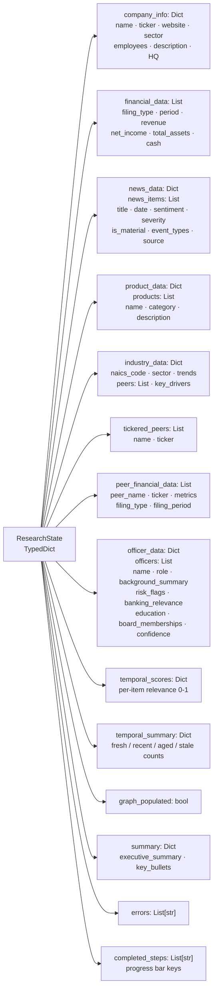
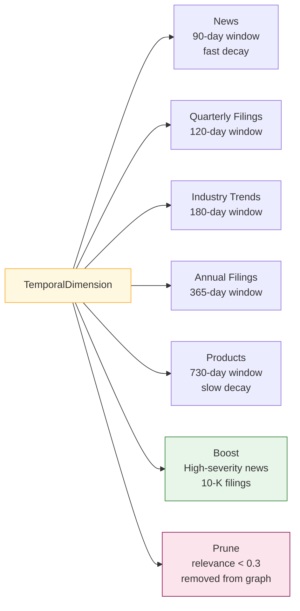

# Context Fabric — Agent Flow

## LangGraph Research Pipeline

The orchestrator runs an **8-node LangGraph workflow** — one fresh `BankingResearchOrchestrator` instance per job (enables concurrent demos). Nodes emit progress events; the frontend polls `/research/status/{job_id}` every 2 seconds.

```mermaid
flowchart TD
    START(["research_company()\nname · ticker · website"])

    subgraph PIPELINE["LangGraph Workflow — BankingResearchOrchestrator  (1 instance per job)"]
        N1["① scrape_company_info\nWebScraperAgent\nBeautifulSoup scrape + LLM profile extraction\nOutputs: name · ticker · description · sector · employees · HQ"]
        N2["② fetch_financials\nEdgarAgent\nSEC EDGAR 10-K + 10-Q · ticker normalisation\nOllama: 12k char cap  |  Anthropic: 150k char\nOutputs: revenue · EBITDA · assets · cash · EPS · key_risks"]
        N3["③ analyze_industry\nIndustryAgent\nNAICS classification via LLM\nOllama path: DDG search + direct LLM (no ReAct)\nAnthropic path: ReAct agent with tools\nHard rule: peers filtered to same NAICS sector\nOutputs: naics_code · peers (4-6) · trends · growth_outlook"]
        N4["④ fetch_peer_financials\nEdgarAgent per peer  (ThreadPoolExecutor)\nSkips non-US / untickered peers\nOutputs: peer_financial_data list"]

        subgraph PAR["⑤ parallel_news_products_officers  (3 threads)"]
            P1["NewsAgent + NewsClassifier\nDDG 3-query search\nLLM batch sentiment classification (5 items/call)\nOutputs: title · date · sentiment · severity · is_material"]
            P2["ProductAgent\nLLM maps sector+size → banking product portfolio\nOutputs: products list with category + description"]
            P3["OfficerAgent\nDDG discovery + proxy/DEF14A scrape\n4 deep-profile searches per officer\nOutputs: background · risk_flags · board_memberships · education"]
        end

        N5["⑥ apply_temporal_scoring\nTemporalDimension\nDecay curves: news 90d · 10-Q 120d · trends 180d · 10-K 365d · products 730d\nDate parser: handles Q1 2026 / FY2024 / ISO / datetime\nPrunes items below 0.3 · boosts material events\nOutputs: temporal_scores · temporal_summary"]
        N6["⑦ populate_graph\nNeo4j MERGE  (neo4j_db.py)\nWrites: Company · FinancialData · NewsItem · Product\n  Industry · Officer · peer HAS_PEER edges\nOfficer: normalize names · persist profiled flag\nPeers: resolve canonical name · dedup by ticker+normalized name\nOutputs: graph_populated=true"]
        N7["⑧ generate_summary\nLLM  (Claude Sonnet 4.6 or Ollama)\nSynthesises all state dimensions\nOutputs: executive_summary · key_bullets"]
    end

    DONE(["Result dict returned to API\ndimensions · summary · errors · completed_steps"])

    START --> N1 --> N2 --> N3 --> N4 --> PAR --> N5 --> N6 --> N7 --> DONE

    style START fill:#D71E28,color:#fff,stroke:#D71E28
    style DONE  fill:#2e7d32,color:#fff,stroke:#2e7d32
    style PIPELINE fill:#f9f9f9,stroke:#cccccc
    style N1 fill:#e3f2fd,stroke:#1565c0
    style N2 fill:#e3f2fd,stroke:#1565c0
    style N3 fill:#f3e5f5,stroke:#6a1b9a
    style N4 fill:#e3f2fd,stroke:#1565c0
    style PAR fill:#fff8e1,stroke:#f9a825
    style P1 fill:#fff3e0,stroke:#e65100
    style P2 fill:#e8f5e9,stroke:#2e7d32
    style P3 fill:#fce4ec,stroke:#880e4f
    style N5 fill:#fff8e1,stroke:#f9a825
    style N6 fill:#e0f2f1,stroke:#00695c
    style N7 fill:#e8f5e9,stroke:#2e7d32
```



## On-Demand AI Features

These run independently of the research pipeline — called per-request from the dashboard or API.

```mermaid
flowchart LR
    NEO[("Neo4j")]
    ANT["LLM\n(Claude or Ollama)"]
    DDG["DuckDuckGo"]
    EDGAR["SEC EDGAR"]
    YF["yfinance"]

    subgraph RM["On-Demand Endpoints"]
        F1["Deal Trigger Alerts\nGET /company/{name}/triggers\nLLM classifies news + financials\nOutputs: type · urgency · product · action"]
        F2["Covenant Watch\nGET /company/{name}/covenant-watch\nComputes D/EBITDA · interest coverage\nnet margin · ROA vs configurable thresholds"]
        F3["Incumbent Bank Detection\nGET /company/{name}/incumbent-bank\nDDG + SEC credit agreement search\nOutputs: primary bank · lenders · facility · opportunity"]
        F4["Meeting Brief\nGET /company/{name}/meeting-brief\nLLM synthesises all Neo4j dimensions\nheadline · 3 going well · 3 risks · questions · email\ntoStr() normalises Ollama dict responses"]
        F5["Pitch Score\nGET /company/{name}/pitch-score\n5-dimension weighted score\nNAICS fit · recency · officers · triggers · financials"]
        F6["Relationship Map\nGET /company/{name}/relationship-map\nCross-ref officers vs 17 WF banker roster\nBoard Interlock + Alumni Network"]
        F7["Peer Comparison\nGET /company/{name}/peer-comparison\nSame-NAICS peers · revenue/margin/debt table\nDeduped by ticker + normalized name"]
        F8["Recommendations\nGET /company/{name}/recommendations\nLLM generates pitch + product suggestions"]
        F9["Activity Log\nGET POST DELETE /company/{name}/activity\nPersist calls · emails · meetings · notes"]
        F10["Deals History\nGET POST DELETE /company/{name}/deals\nTrack WF products by category · status · amount"]
        F11["RM Portfolio + Heatmap\nGET /rm/portfolio\nGET /rm/industry-heatmap\nAggregated stats + sector risk scores"]
        F12["Stock Data\nGET /stock/{ticker}/around-dates\nyfinance ± N days around key events"]
    end

    NEO --> F1 & F2 & F5 & F6 & F7 & F8 & F9 & F10 & F11
    ANT --> F1 & F4 & F8
    DDG --> F3
    EDGAR --> F3
    YF --> F12

    style RM fill:#fff3f3,stroke:#D71E28
    style F1 fill:#fce4ec,stroke:#880e4f
    style F2 fill:#e3f2fd,stroke:#1565c0
    style F3 fill:#fff8e1,stroke:#C8A951
    style F4 fill:#e8f5e9,stroke:#2e7d32
    style F5 fill:#fff8e1,stroke:#f9a825
    style F6 fill:#f3e5f5,stroke:#6a1b9a
    style F7 fill:#e3f2fd,stroke:#1565c0
    style F8 fill:#e8f5e9,stroke:#2e7d32
    style F9 fill:#e0f7fa,stroke:#006064
    style F10 fill:#e0f7fa,stroke:#006064
    style F11 fill:#fce4ec,stroke:#D71E28
    style F12 fill:#f5f5f5,stroke:#9e9e9e
```



## ResearchState — Data Flow



## Temporal Decay Curves



## Individual Agent Details

### WebScraperAgent
```
Input:  company_name, website URL
Tools:  requests + BeautifulSoup (HTML scrape)
LLM:    get_llm() — structured company profile extraction
Output: { name, ticker, description, employees, headquarters, sector, founded }
```

### EdgarAgent
```
Input:  company_name, ticker
Tools:  sec-edgar-downloader → local sec-edgar-filings/ (disk cache first)
        _normalise_ticker() alias map (e.g. "3M" → "MMM")
        Foreign ticker skip (.KS, .HK, .L, .DE ...)
LLM:    get_llm() — extracts metrics from filing text
        Ollama: max_chars=12,000 (fits 8k context window)
        Anthropic: max_chars=150,000
Output: { revenue, net_income, total_assets, cash, ebitda, key_risks,
          filing_date (YYYY-MM-DD), filing_period (Q1 2026 / FY2024), filing_type }
```

### NewsAgent + NewsClassifier
```
Input:  company_name
Tools:  DuckDuckGo (ddgs) — 3 queries, 15 items cap
LLM:    get_llm() — classify in batches of 5 via robust_parse_json
Output: { sentiment, severity, is_material, event_types, key_facts, summary }
```

### ProductAgent
```
Input:  company_name, company_info
LLM:    Claude — generate plausible banking product portfolio
Output: List[{ name, category, description, revenue_impact }]
```

### IndustryAgent
```
Input:  company_name, company_info
Tools:  DuckDuckGo — competitor search + industry trends
LLM:    get_llm() with two paths:
        Anthropic: ReAct agent (tool-calling) with recursion_limit=5
        Ollama:    Direct DDG search → SystemMessage/HumanMessage (no ReAct — llama3
                   doesn't support tool-calling)
Post-filter: _filter_peers_by_naics() drops any peer whose ticker maps to a
             different NAICS sector (e.g. AAPL, AMZN rejected for a manufacturer)
Output: { naics_code, naics_sector, peers: [{name, ticker, relationship}], trends, key_drivers }
```

### OfficerAgent
```
Input:  company_name
Tools:  DuckDuckGo — 1 discovery query + 4 deep-profile queries per officer
        BeautifulSoup — company website leadership + SEC DEF 14A proxy scrape
LLM:    Always Claude Sonnet 4.6 (ignores LLM_PROVIDER — officer profiling needs
        strong reasoning; Ollama quality is insufficient)
Neo4j:  _normalize_officer_name() strips middle initials before MERGE
        profiled=True persisted so frontend shows full cards (not stubs)
Output: { officers: [{ name, role, background_summary, education, previous_roles,
           tenure_years, board_memberships, risk_flags, banking_relevance,
           confidence, profiled }] }
```

### TemporalDimension
```
Input:  All dimension data from ResearchState
Date parser: handles Q1 2026 / FY2024 / YYYY-MM-DD / ISO datetime
Decay curves: news 90d · 10-Q 120d · trends 180d · 10-K 365d · products 730d
Boosts:  high-severity news, 10-K filings
Prunes:  items with relevance_score < 0.3
Output: { relevance_scores, temporal_summary: { fresh, recent, aged, stale } }
```

