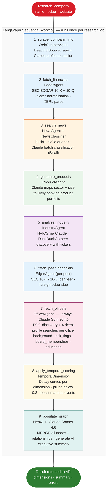
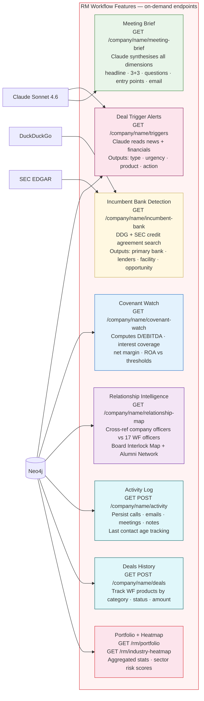
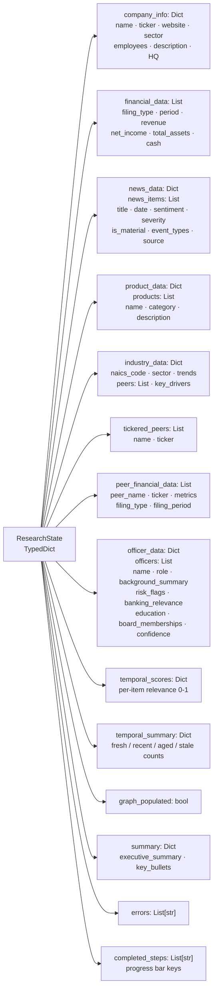
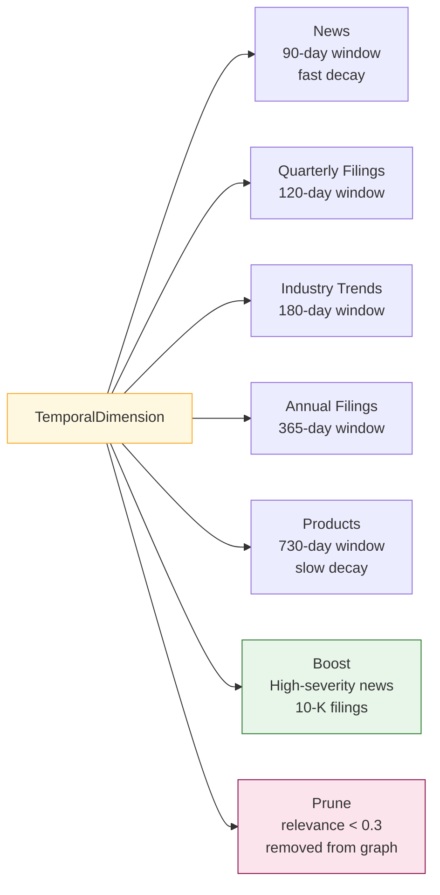

# Context Fabric — Agent Flow

## LangGraph Research Pipeline

The orchestrator runs a **9-node sequential LangGraph workflow**. Each node is a method on `BankingResearchOrchestrator`. Nodes emit progress events; the frontend polls `/research/status/{job_id}` every 2 seconds.



## On-Demand AI Features

These run independently of the research pipeline — called per-request from the dashboard or API.



## ResearchState — Data Flow



## Temporal Decay Curves



## Individual Agent Details

### WebScraperAgent
```
Input:  company_name, website URL
Tools:  requests + BeautifulSoup (HTML scrape)
LLM:    Claude — structured company profile extraction
Output: { name, ticker, description, employees, headquarters, sector, founded }
```

### EdgarAgent
```
Input:  company_name, ticker
Tools:  sec-edgar-downloader -> local sec-edgar-filings/
        _normalise_ticker() alias map (e.g. "3M" -> "MMM")
        Foreign ticker skip (.KS, .HK, .L, .DE ...)
LLM:    none — regex/text extraction from filing text
Output: { revenue, net_income, total_assets, cash, filing_date, filing_type, period }
```

### NewsAgent + NewsClassifier
```
Input:  company_name
Tools:  DuckDuckGo (ddgs) — 2 queries: negative news + general news, 15 items cap
LLM:    Claude — classify in batches of 5
Output: { sentiment, severity, is_material, event_types, key_facts, summary }
```

### ProductAgent
```
Input:  company_name, company_info
LLM:    Claude — generate plausible banking product portfolio
Output: List[{ name, category, description, revenue_impact }]
```

### IndustryAgent
```
Input:  company_name, company_info
Tools:  DuckDuckGo — industry background search
LLM:    Claude — NAICS classification, peer discovery (with tickers), trend analysis
Output: { naics_code, sector, peers: [{name, ticker}], trends, key_drivers }
```

### OfficerAgent  (always Claude Sonnet 4.6 — ignores LLM_PROVIDER env)
```
Input:  company_name
Tools:  DuckDuckGo — 1 discovery query + 4 deep-profile queries per officer
LLM:    Claude Sonnet 4.6 — extract officer list; build deep profile per person
Output: { officers: [{ name, role, background_summary, education, previous_roles,
           tenure_years, linkedin_url, key_achievements, recent_news,
           publications_speaking, board_memberships, risk_flags,
           banking_relevance, confidence }] }
```

### TemporalDimension
```
Input:  All dimension data from ResearchState
Logic:  Dimension-specific decay curves (see diagram above)
        Boost: high-severity news, 10-K filings
        Prune: items with relevance_score < 0.3
Output: { relevance_scores, temporal_summary: { fresh, recent, aged, stale } }
```

