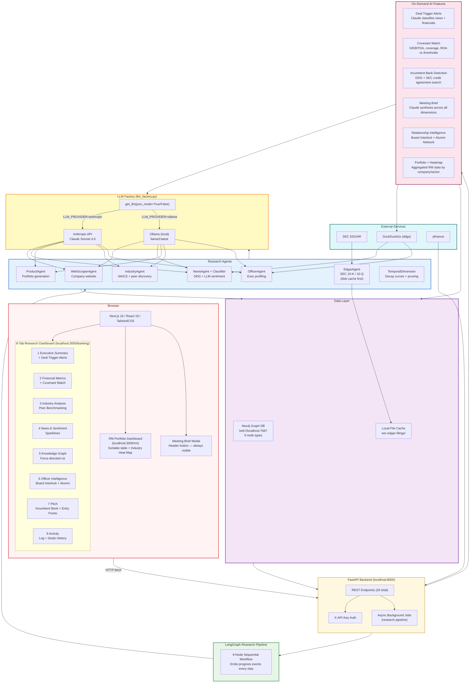

# Context Fabric — System Architecture

## Full Stack Architecture



## Component Breakdown

| Layer | Technology | Purpose |
|-------|-----------|----------|
| Frontend | Next.js 16, React 19, TypeScript, TailwindCSS | 8-tab research dashboard + /rm portfolio page |
| API | FastAPI, Python 3.10+, uvicorn | 26 REST endpoints, async job management, PDF streaming |
| Orchestration | LangGraph + LangChain | Sequential 9-node research pipeline |
| LLM | Claude Sonnet 4.6 (Anthropic) or Ollama llama3 | Research synthesis, triggers, covenants, meeting brief, officer profiling — switchable via `LLM_PROVIDER` env |
| Graph DB | Neo4j 4.x (Docker) | Knowledge graph — 9 node types, activity + deal tracking |
| PDF | reportlab 4.x | A4 branded intelligence brief |
| SEC Data | sec-edgar-downloader | 10-K / 10-Q filing downloads — disk-cached 55+ tickers |
| Search | ddgs (DuckDuckGo) | News, officer discovery, incumbent bank detection |
| Stock Data | yfinance | Price sparklines around news event dates |

## Neo4j Graph Schema


**Relationship Intelligence cross-reference:**
`(:Company {name:"Wells Fargo"})-[:HAS_OFFICER]->(:Officer)` is cross-referenced against every researched company's officers to surface board interlocks and alumni ties.

## API Endpoints Reference

```
POST /research/start                     Start async research job
GET  /research/status/{job_id}           Poll progress
GET  /research/jobs                      List all jobs

GET  /companies                          All companies in graph
GET  /company/{name}/graph               Full graph data (all dimensions)
GET  /company/{name}/visualization       Force-graph visualization data
GET  /company/{name}/freshness           Temporal freshness scores
GET  /company/{name}/peer-comparison     Target + peer EDGAR financials
GET  /company/{name}/officers            Stored officer profiles
GET  /company/{name}/triggers            Deal trigger analysis (Claude)
GET  /company/{name}/covenant-watch      Financial ratio monitoring
GET  /company/{name}/incumbent-bank      Incumbent bank detection
GET  /company/{name}/meeting-brief       Pre-meeting synthesis brief
GET  /company/{name}/activity            RM activity log
POST /company/{name}/activity            Log call / email / meeting
DELETE /activity/{activity_id}           Remove activity entry
GET  /company/{name}/deals               Prior WF products / deals
POST /company/{name}/deals               Add deal record
DELETE /deal/{deal_id}                   Remove deal record
GET  /company/{name}/relationship-map    Board interlock + alumni connections
GET  /rm/portfolio                       All companies with RM stats
GET  /rm/industry-heatmap                Sector risk scores
GET  /company/{name}/report              JSON intelligence report  [API key]
GET  /company/{name}/report/pdf          PDF intelligence brief    [API key]

POST /officer/search                     Research a named individual
GET  /stock/{ticker}/around-dates        Stock prices around event dates

DELETE /company/{name}                   Clear company from graph
GET  /health                             System health check
```
