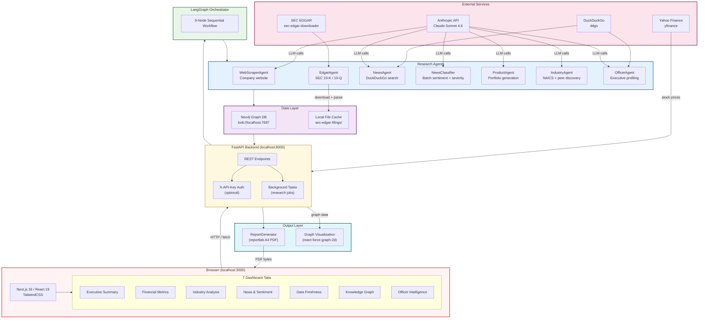
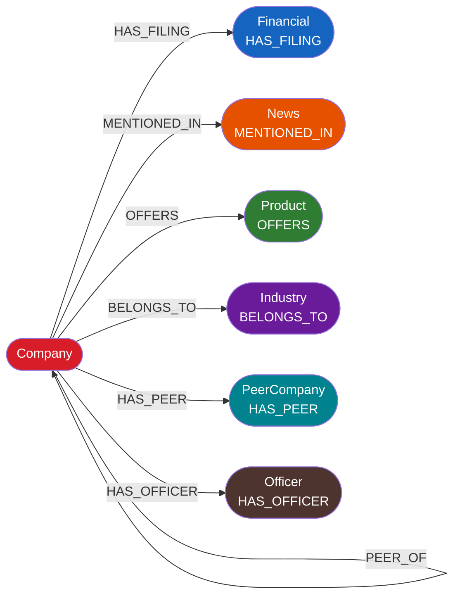

# Context Fabric — System Architecture

## Full Stack Architecture



## Component Breakdown

| Layer | Technology | Purpose |
|-------|-----------|---------|
| Frontend | Next.js 16, React 19, TypeScript, TailwindCSS | Interactive dashboard, 7-tab UI |
| API | FastAPI, Python 3.10+, uvicorn | REST endpoints, job management, PDF streaming |
| Orchestration | LangGraph + LangChain | Sequential 9-node research workflow |
| LLM | Claude Sonnet 4.6 (Anthropic) | Company analysis, news classification, officer profiling |
| Graph DB | Neo4j 4.x (Docker) | Knowledge graph storage + Cypher queries |
| PDF | reportlab 4.x | A4 intelligence brief generation |
| SEC Data | sec-edgar-downloader | 10-K / 10-Q filing downloads |
| Search | ddgs (DuckDuckGo) | News search, officer background research |
| Stock Data | yfinance | Price sparklines around news event dates |

## Neo4j Graph Schema



## API Endpoints Reference

```
POST /research/start                     Start company research job
GET  /research/status/{job_id}           Poll research progress
GET  /research/jobs                      List all jobs

GET  /companies                          List all companies in graph
GET  /company/{name}/graph               Full graph data (all dimensions)
GET  /company/{name}/visualization       Force-graph visualization data
GET  /company/{name}/freshness           Temporal freshness scores
GET  /company/{name}/peer-comparison     Target + peer EDGAR financials
GET  /company/{name}/officers            Stored officer profiles
GET  /company/{name}/report             ★ JSON intelligence report  [API key]
GET  /company/{name}/report/pdf         ★ PDF intelligence brief    [API key]

POST /officer/search                     Research a named individual
GET  /stock/{ticker}/around-dates        Stock prices around event dates

DELETE /company/{name}                   Clear company from graph
GET  /health                             System health check
```

`★` = protected by `X-API-Key` header when `BANKING_API_KEY` env var is set.
