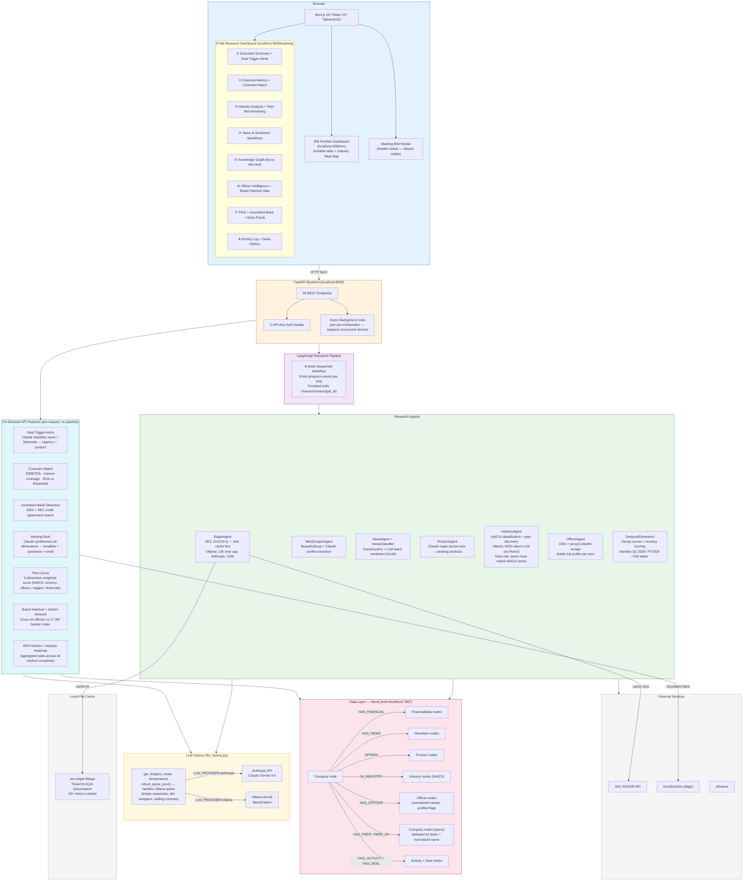
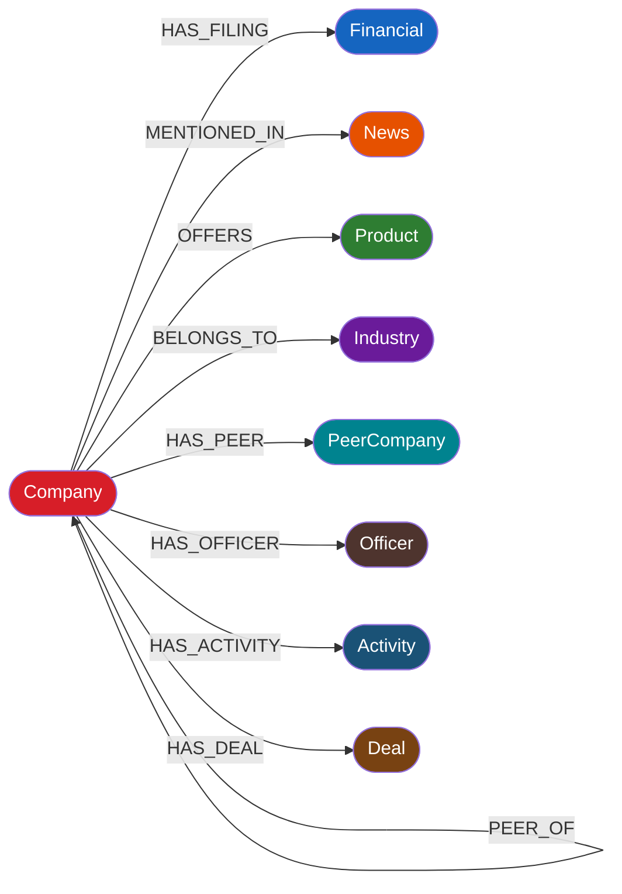

# Context Fabric — System Architecture

## Full Stack Architecture



## Neo4j Node Types

| Node Label | Key Properties |
|---|---|
| `Company` | name, ticker, website, sector, employees, description |
| `FinancialData` | filing_type, period, revenue, net_income, total_assets, cash, ebitda |
| `NewsItem` | title, date, sentiment, severity, is_material, event_types |
| `Product` | name, category, description |
| `Industry` | naics_code, naics_sector, sector_name, subsector |
| `Officer` | name, role, background_summary, risk_flags, board_memberships, profiled |
| `Company` (peer) | same as Company — deduped by ticker then normalized name |
| `Activity` | type, date, notes, contact_name |
| `Deal` | product, category, amount, status, date |

## Environment Variables

```
ANTHROPIC_API_KEY=     # used when LLM_PROVIDER=anthropic
NEO4J_URI=bolt://localhost:7687
NEO4J_USER=neo4j
NEO4J_PASSWORD=password
USER_EMAIL=            # SEC EDGAR courtesy header
LLM_PROVIDER=ollama    # or: anthropic
OLLAMA_MODEL=llama3:latest
```

            T1["1 Executive Summary\n+ Deal Trigger Alerts"]
            T2["2 Financial Metrics\n+ Covenant Watch"]
            T3["3 Industry Analysis\nPeer Benchmarking"]
            T4["4 News & Sentiment\nSparklines"]
            T5["5 Knowledge Graph\nForce-directed viz"]
            T6["6 Officer Intelligence\nBoard Interlock + Alumni"]
            T7["7 Pitch\nIncumbent Bank + Entry Points"]
            T8["8 Activity\nLog + Deals History"]
        end
        RM["RM Portfolio Dashboard\n(localhost:3000/rm)\nSortable table + Industry Heat Map"]
        MB["Meeting Brief Modal\nHeader button — always visible"]
        UI --> Tabs
        UI --> RM
        UI --> MB
    end

    subgraph API["FastAPI Backend  (localhost:8000)"]
        direction TB
        EP["REST Endpoints (26 total)"]
        AUTH["X-API-Key Auth"]
        BG["Async Background Jobs\n(research pipeline)"]
        EP --> AUTH
        EP --> BG
    end

    subgraph Pipeline["LangGraph Research Pipeline"]
        WF["9-Node Sequential Workflow\nEmits progress events every step"]
    end

    subgraph Agents["Research Agents"]
        A1["WebScraperAgent\nCompany website"]
        A2["EdgarAgent\nSEC 10-K / 10-Q\n(disk cache first)"]
        A3["NewsAgent + Classifier\nDDG + LLM sentiment"]
        A4["ProductAgent\nPortfolio generation"]
        A5["IndustryAgent\nNAICS + peer discovery"]
        A6["OfficerAgent\nExec profiling"]
        A7["TemporalDimension\nDecay curves + pruning"]
    end

    subgraph LLMFactory["LLM Factory (llm_factory.py)"]
        direction LR
        LLMF["get_llm(json_mode=True/False)"]
        LLMF -->|"LLM_PROVIDER=anthropic"| ANT
        LLMF -->|"LLM_PROVIDER=ollama"| OLL
    end

    subgraph OnDemand["On-Demand AI Features"]
        OD1["Deal Trigger Alerts\nClaude classifies news + financials"]
        OD2["Covenant Watch\nD/EBITDA, coverage, ROA vs thresholds"]
        OD3["Incumbent Bank Detection\nDDG + SEC credit agreement search"]
        OD4["Meeting Brief\nClaude synthesis across all dimensions"]
        OD5["Relationship Intelligence\nBoard Interlock + Alumni Network"]
        OD6["Portfolio + Heatmap\nAggregated RM stats by company/sector"]
    end

    subgraph Storage["Data Layer"]
        NEO["Neo4j Graph DB\nbolt://localhost:7687\n9 node types"]
        CACHE["Local File Cache\nsec-edgar-filings/"]
    end

    subgraph External["External Services"]
        ANT["Anthropic API\nClaude Sonnet 4.6"]
        OLL["Ollama (local)\nllama3:latest"]
        EDGAR["SEC EDGAR"]
        DDG["DuckDuckGo (ddgs)"]
        YF["yfinance"]
    end

    Browser -->|"HTTP fetch"| API
    API --> Pipeline
    Pipeline --> Agents
    API --> OnDemand
    OnDemand --> LLMFactory
    Agents --> LLMFactory
    OLL --> A1
    ANT --> A1
    OLL --> A3
    ANT --> A3
    OLL --> A4
    ANT --> A4
    OLL --> A5
    ANT --> A5
    OLL --> A6
    ANT --> A6
    A2 --> CACHE
    EDGAR --> A2
    DDG --> A3
    DDG --> A6
    OnDemand --> DDG
    OnDemand --> Storage
    Agents --> Storage
    YF --> API
    Storage --> API

    style Browser fill:#fff3f3,stroke:#D71E28,stroke-width:2px
    style API fill:#fff8e1,stroke:#C8A951,stroke-width:2px
    style Pipeline fill:#e8f5e9,stroke:#2e7d32,stroke-width:2px
    style Agents fill:#e3f2fd,stroke:#1565c0,stroke-width:2px
    style LLMFactory fill:#fff9c4,stroke:#f57f17,stroke-width:2px
    style OnDemand fill:#fce4ec,stroke:#880e4f,stroke-width:2px
    style Storage fill:#f3e5f5,stroke:#6a1b9a,stroke-width:2px
    style External fill:#e0f7fa,stroke:#006064,stroke-width:2px
```

## Component Breakdown

| Layer | Technology | Purpose |
|-------|-----------|----------|
| Frontend | Next.js 16, React 19, TypeScript, TailwindCSS | 8-tab research dashboard + /rm portfolio page |
| API | FastAPI, Python 3.10+, uvicorn | 26 REST endpoints, async job management, PDF streaming |
| Orchestration | LangGraph + LangChain | Sequential 9-node research pipeline |
| LLM | Claude Sonnet 4.6 (Anthropic) or Ollama llama3 | Research synthesis, triggers, covenants, meeting brief, officer profiling — switchable via `LLM_PROVIDER` env |
| Graph DB | Neo4j 4.x (Docker) | Knowledge graph — 9 node types, activity + deal tracking |
| PDF | reportlab 4.x | A4 branded intelligence brief |
| SEC Data | sec-edgar-downloader | 10-K / 10-Q filing downloads — disk-cached 55+ tickers |
| Search | ddgs (DuckDuckGo) | News, officer discovery, incumbent bank detection |
| Stock Data | yfinance | Price sparklines around news event dates |

## Neo4j Graph Schema



**Relationship Intelligence cross-reference:**
`(:Company {name:"Wells Fargo"})-[:HAS_OFFICER]->(:Officer)` is cross-referenced against every researched company's officers to surface board interlocks and alumni ties.

## API Endpoints Reference

```
POST /research/start                     Start async research job
GET  /research/status/{job_id}           Poll progress
GET  /research/jobs                      List all jobs

GET  /companies                          All companies in graph
GET  /company/{name}/graph               Full graph data (all dimensions)
GET  /company/{name}/visualization       Force-graph visualization data
GET  /company/{name}/freshness           Temporal freshness scores
GET  /company/{name}/peer-comparison     Target + peer EDGAR financials
GET  /company/{name}/officers            Stored officer profiles
GET  /company/{name}/triggers            Deal trigger analysis (Claude)
GET  /company/{name}/covenant-watch      Financial ratio monitoring
GET  /company/{name}/incumbent-bank      Incumbent bank detection
GET  /company/{name}/meeting-brief       Pre-meeting synthesis brief
GET  /company/{name}/activity            RM activity log
POST /company/{name}/activity            Log call / email / meeting
DELETE /activity/{activity_id}           Remove activity entry
GET  /company/{name}/deals               Prior WF products / deals
POST /company/{name}/deals               Add deal record
DELETE /deal/{deal_id}                   Remove deal record
GET  /company/{name}/relationship-map    Board interlock + alumni connections
GET  /rm/portfolio                       All companies with RM stats
GET  /rm/industry-heatmap                Sector risk scores
GET  /company/{name}/report              JSON intelligence report  [API key]
GET  /company/{name}/report/pdf          PDF intelligence brief    [API key]

POST /officer/search                     Research a named individual
GET  /stock/{ticker}/around-dates        Stock prices around event dates

DELETE /company/{name}                   Clear company from graph
GET  /health                             System health check
```
